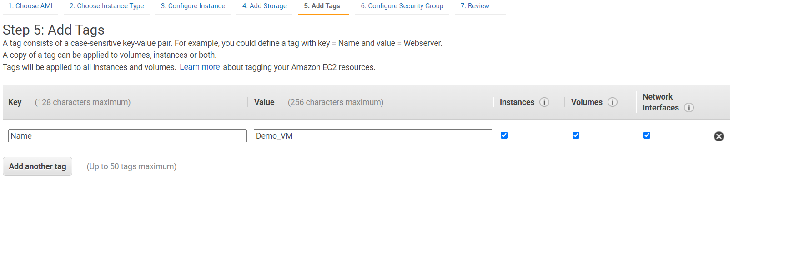
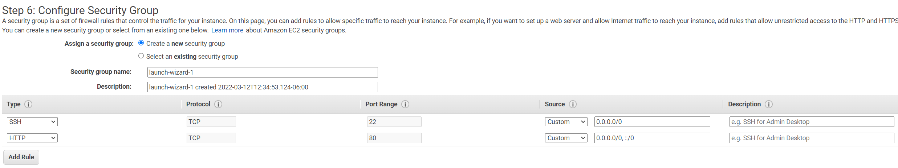
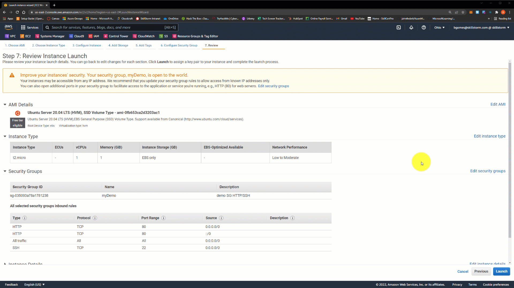

# EC2 Lab1
---
---
>***Open the AWS console at [aws.amazon.con](https://aws.amazon.com/)***
>
>Select EC2 from the search bar after you log in. 
>
>
>
>You should be taken tot eh EC2 dashboard pictured below
>
>Click Launch instance and select the launch instance option
>
>**Step 1:** Choose your Amazon Machine Image
> 
>>***You can choose from the quick start guide, your own custom images, marketplace images, or community created images.***  
>
>For purposes of this lab, choose a free tier image.  I will select an ubuntu image shown below. 
> 
> **Step 2:** Choose the instance type - t2.micro
> 
> **Step 3:** Configure instance details. For purposes of this lab we will keep all of these settings as default. 
> 
> **Step 4:** keep default storage options
> 
> **Step 5:** You can add tags to the VM
> 
>**Step 6:** Add security group with ports 22 and 80 open.  
> 
>>***click review and launch at the bottom right of your screen***
>>
>>***Ensure all of the settings are as expected then click launch.***
>>
>>***Once you click launch you will be prompted for an SSH key*** 
>>
>>***You can either create and download a new key or use an existing key.*** 

