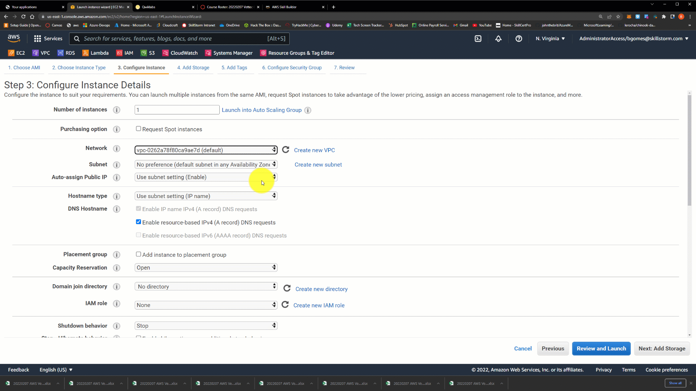
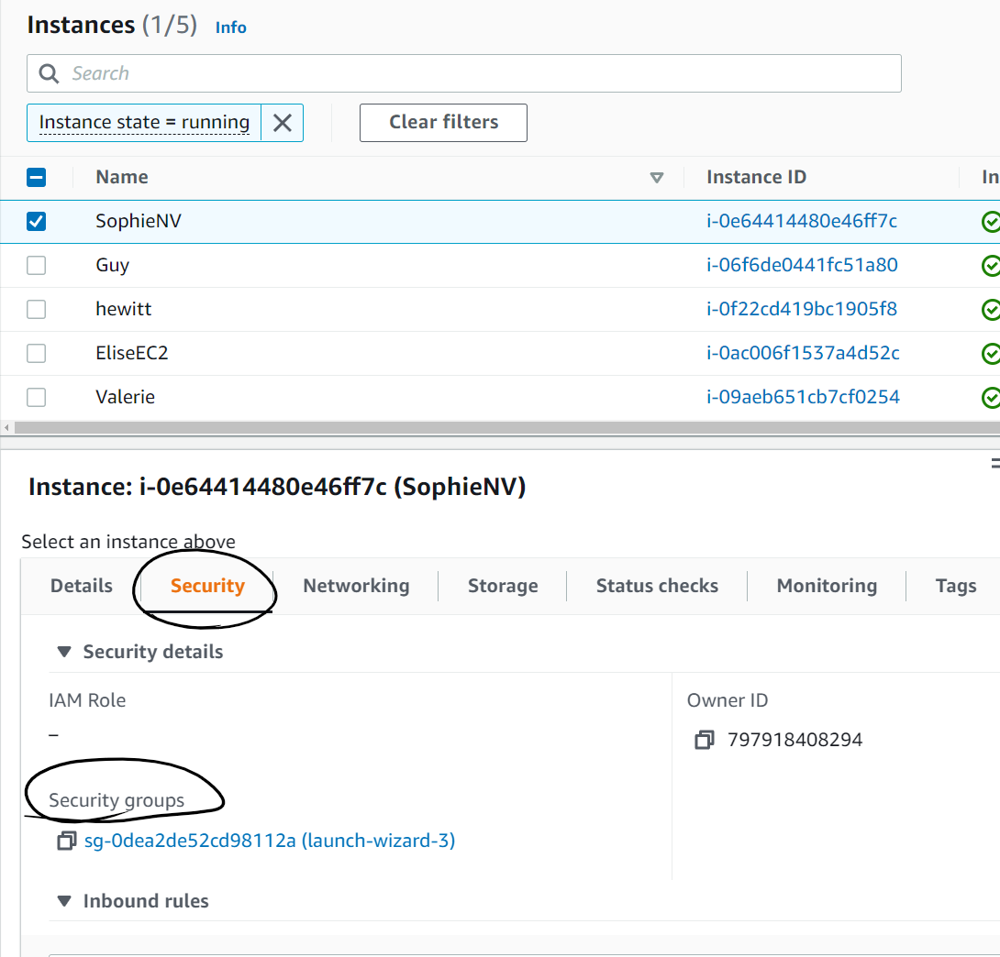
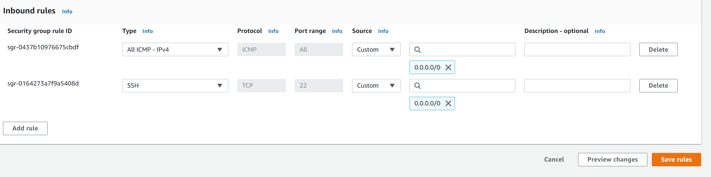
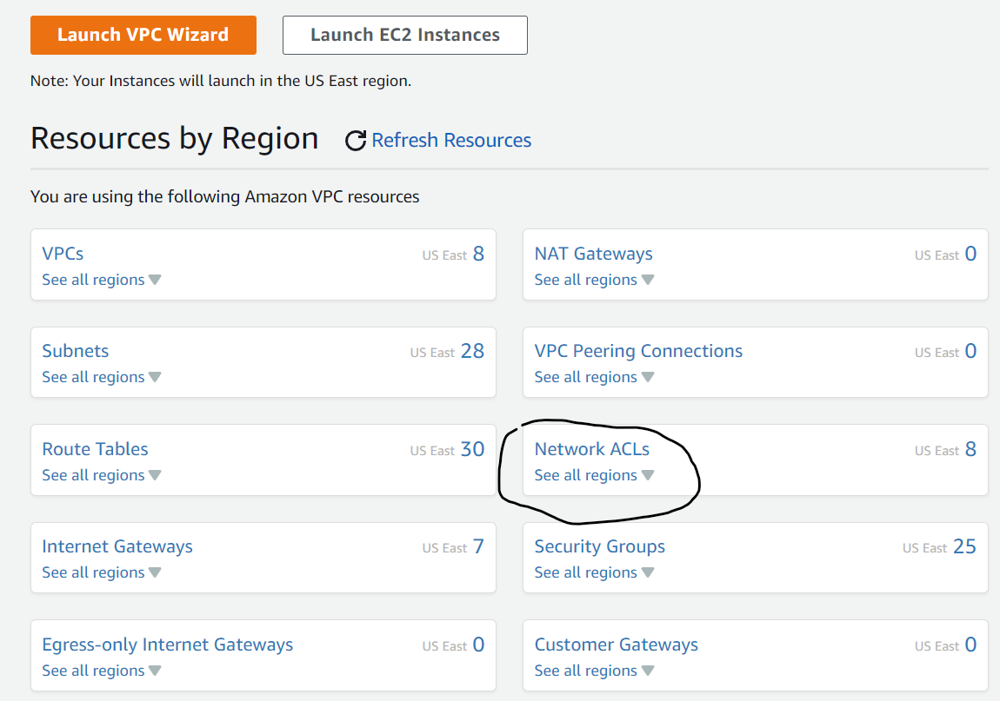

# Set up Traffic Security using Security Groups and Network Access Control Lists
---
## Part 1: Create your VPC and Set up two Instances
---
>***Open the AWS console at [aws.amazon.con](https://skillstorm.awsapps.com/start)***
>
>***Step 1:*** Create a VPC in the North Virginia Region ([VPC Lab](https://github.com/bdgomey/AWS_Labs/blob/master/Networking/create_VPC.md)) 
>
>***Step 2:*** Create an EC2 instance in your newly built VPC
>
>**Remember**: You will have to select your own VPC in the **"Configure Instance Details"** Step.  
>
>**1**: Network - Select your network you created
>
>**2**: Subnet - Select your public Subnet
>'
>**3**: Auto-assign Public IP - Ensure you see "Enable"  if you do nt, select the dropdown box and enable the Public IP
>
>***Step 3:*** Create an EC2 instance in Us-East-2 in the default VPC.  Follow the [EC2 lab](https://github.com/bdgomey/AWS_Labs/blob/master/Compute/SSH_to_instance.md) if you need help.
>
>SSH into both instances once complete
>
>Common errors: Wrong VPC in N. Virginia, Wrong subnet (must select public subnet), did not auto assign public IP address in your instance details step.   
---
## Part 2: Set up Network Security Groups and Network Access Control Lists
>***Step 1:*** go to your instance and select the security group attached to it. 
>
>
>***Step 2:*** Make sure that you have both SSH and ICMP traffic allowed in your security group like below:
>
>***Step 3:*** Next: Go to the VPC Dashboard
>
>***Step 4*** Select your Access Control List
>