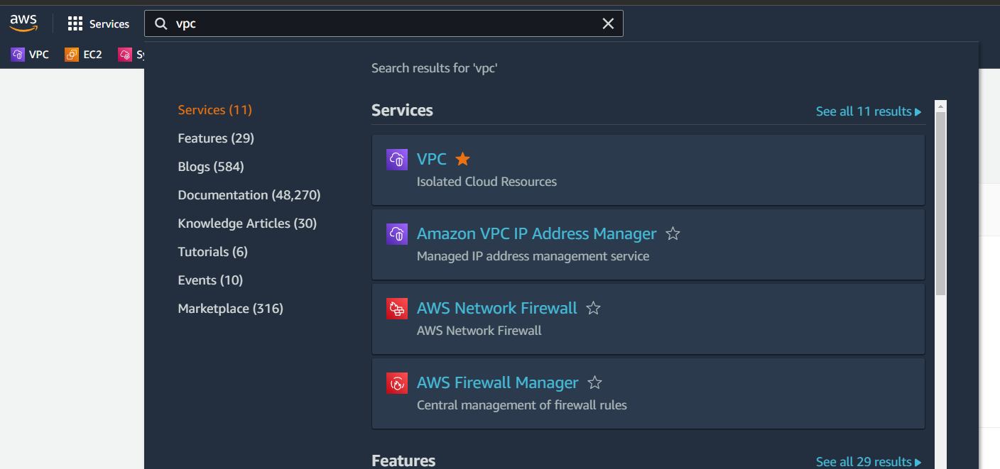
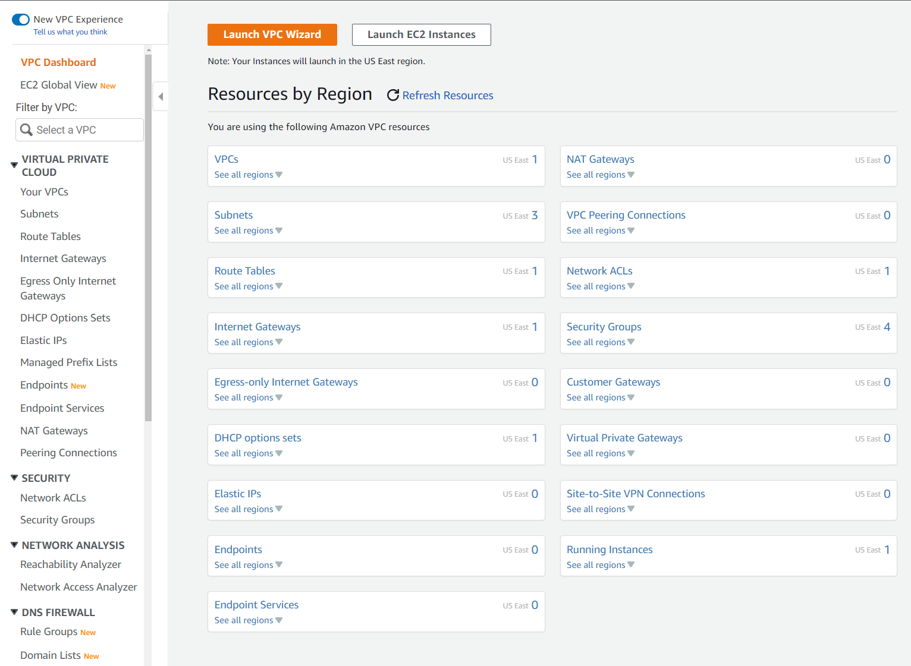

# Create VPC
---
## Part 1: Go to the VPC Wizard
---
>***Open the AWS console at [aws.amazon.con](https://aws.amazon.com/)***
>
>Select VPC from the search bar after you log in. 
>
>
>
>You should be taken to the VPC dashboard pictured below
>
>>***From here you have 2 options to create a VPC.  You can select VPCs in the dashboard or you can launch the VPC Wizard at the top.  For this lab we will be using the wizard.***  
>
 

>

>
>Select Launch Wizard and you will be taken to the screen :
>