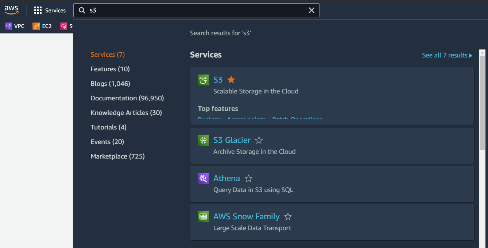
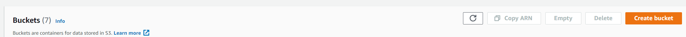

# S3 Static Website Demo
---
## Part 1: Create your instance
---
>***Open the AWS console at [aws.amazon.con](https://aws.amazon.com/)***
>
>Select S3 from the search bar after you log in. 
>

>Select **Create Bucket**
>

>
>Part 1: Create your Bucket 
>
>>***The bucket name must be a globally unique name***
>>
>>Object Ownership will be disabled ACLs by default.  This will require us to make S3 resource policies to enable access to our buckets. 
>>
>>Block Public Access is enabled by default.  We will uncheck that box and allow public access
>>
>>We will enable bucket versioning
>>
>>The remaining settings on this page will be default settings. 
